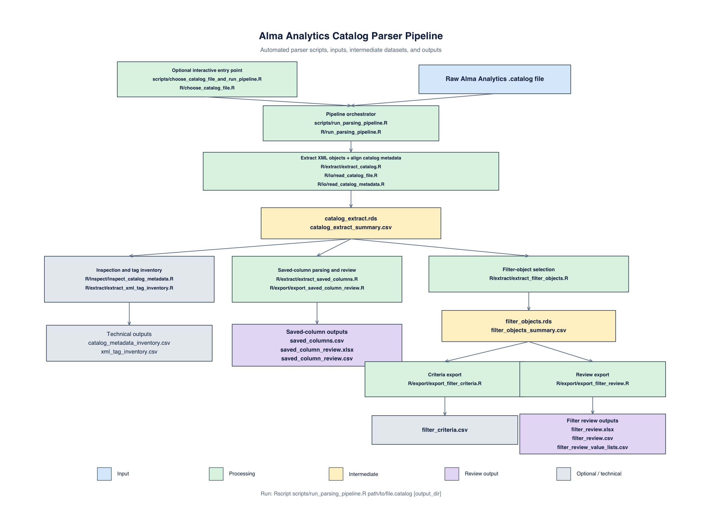
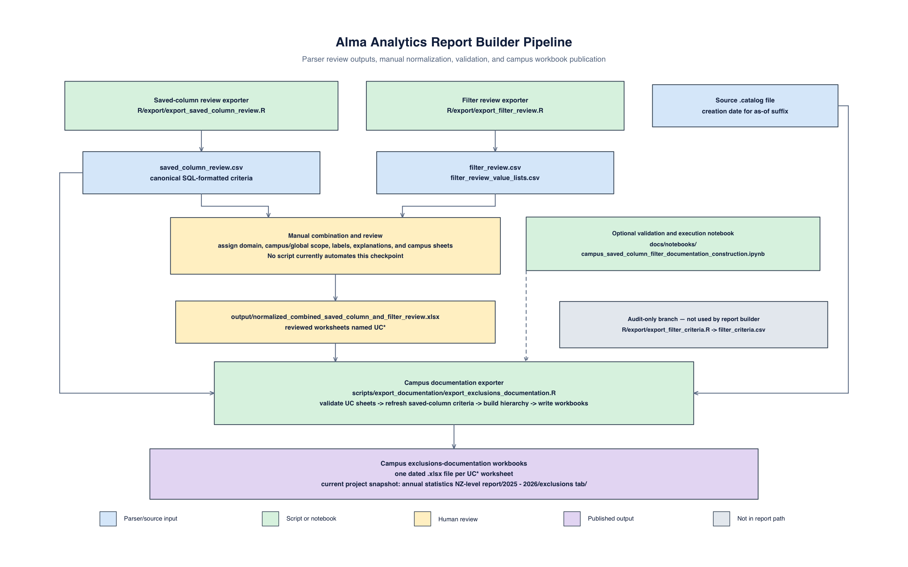

# Alma Analytics catalog file parser

R utilities for extracting and reviewing objects embedded in Ex Libris Alma
Analytics `.catalog` files. The pipeline preserves full XML in RDS files and
writes spreadsheet-friendly CSV files without the large `xml_text` column.

## Notebooks

- [`docs/notebooks/alma_analytics_catalog_file_parser.ipynb`](docs/notebooks/alma_analytics_catalog_file_parser.ipynb)
  is the main GitHub-rendered walkthrough of the parser, method selection, and
  verified example.
- [`docs/notebooks/campus_documentation_construction.ipynb`](docs/notebooks/campus_documentation_construction.ipynb)
  validates the reviewed normalized workbook, previews campus output names,
  and publishes the campus exclusions-documentation workbooks.
- [`docs/notebooks/catalog_file_xml_structure.ipynb`](docs/notebooks/catalog_file_xml_structure.ipynb)
  is a collapsible view of the XML tag hierarchy in the current example
  `.catalog` file. Its R cell regenerates the tree from current pipeline
  outputs.

## Requirements

- R 4.1 or newer
- Core parser: the R packages `xml2` and `writexl`
- Campus exclusions-documentation export: `readxl` and `openxlsx2`
- Optional notebook execution: an R Jupyter kernel and `IRdisplay`
- Optional test runner: `testthat`; equivalent base-R assertions run when it is
  unavailable

Install the packages needed for both documented workflows with:

```r
install.packages(c("xml2", "writexl", "readxl", "openxlsx2"))
```

## Run the automated parser pipeline

From the repository root:

```sh
Rscript scripts/run_parsing_pipeline.R "data/examples/annual_stats_fy_2025_2026.catalog"
```

### Choose a file interactively in RStudio

The wrapper searches both `data/` in this repository and your `~/Downloads`
folder. It also provides a file-browser option for files stored elsewhere.

```r
source("scripts/choose_catalog_file_and_run_pipeline.R")
catalog <- run_catalog_pipeline()
```

## Parser pipeline map



The diagram covers the automated `.catalog` parser. The arrows show the
direction of processing. Blue identifies the original input, green identifies
processing scripts, yellow identifies intermediate datasets, purple identifies
human-facing review outputs, and gray identifies inspection or detailed
technical outputs. The separately reviewed publication workflow is documented
below.

`scripts/choose_catalog_file_and_run_pipeline.R` is an optional interactive
entry point. It selects a `.catalog` file and passes it to
`scripts/run_parsing_pipeline.R`, the command-line entry point for the orchestrator in
`R/run_parsing_pipeline.R`. Reusable functions live under `R/`; scripts under `scripts/`
are intentionally thin entry points.

## Report-builder pipeline map



Regenerate this diagram from the repository root with:

```sh
Rscript scripts/render_report_builder_pipeline_diagram.R
```

The report-builder diagram begins at the parser's saved-column and filter
review outputs. It shows the manual normalization checkpoint, the optional
validation notebook, the campus documentation exporter, and the final campus
workbooks. The technical `filter_criteria.csv` branch is shown separately
because it does not feed the report builder.

| Stage | Script(s) | Reads | Writes |
| --- | --- | --- | --- |
| Input selection and orchestration | `scripts/choose_catalog_file_and_run_pipeline.R`; `scripts/run_parsing_pipeline.R`; `R/choose_catalog_file.R`; `R/run_parsing_pipeline.R` | Raw Alma Analytics `.catalog` file | Starts shared extraction |
| Shared catalog extraction | `R/extract/extract_catalog.R`; `R/io/read_catalog_file.R`; `R/io/read_catalog_metadata.R` | `.catalog` file | `catalog_extract.rds`; `catalog_extract_summary.csv` |
| Metadata and XML-tag inspection | `R/inspect/inspect_catalog_metadata.R`; `R/extract/extract_xml_tag_inventory.R` | `catalog_extract.rds` | `catalog_metadata_inventory.csv`; `xml_tag_inventory.csv` |
| Saved-column parsing and review | `R/extract/extract_saved_columns.R`; `R/export/export_saved_column_review.R` | Saved-column rows in `catalog_extract.rds` | `saved_columns.csv`; `saved_column_review.xlsx`; `saved_column_review.csv` |
| Filter-object selection | `R/extract/extract_filter_objects.R` | Filter rows in `catalog_extract.rds` | `filter_objects.rds`; `filter_objects_summary.csv` |
| Detailed filter criteria | `R/export/export_filter_criteria.R` | `filter_objects.rds` | `filter_criteria.csv` |
| Filter review | `R/export/export_filter_review.R` | `filter_objects.rds` | `filter_review.xlsx`; `filter_review.csv`; `filter_review_value_lists.csv` |
| Reviewed normalization | Manual review in `output/normalized_combined_saved_column_and_filter_review.xlsx` | Saved-column and filter review rows | Campus, domain, labels, explanations, and campus worksheets |
| Campus documentation publication | `scripts/export_documentation/export_exclusions_documentation.R` | Reviewed normalized workbook and source `.catalog` file | One exclusions-documentation workbook per `UC*` worksheet |

### Shared extraction

The first stage always uses `R/extract/extract_catalog.R` to extract the XML
objects and align them with their catalog metadata. It calls the two readers in
`R/io/`.

Creates:

- `output/catalog_extract.rds`: complete object metadata and XML
- `output/catalog_extract_summary.csv`: metadata only, suitable for spreadsheets

`read_catalog_file()` returns one row per XML object. `read_catalog_metadata()`
aligns object name, path, kind, signature, ownership, and timestamps to those
rows. Folder-only catalog metadata is intentionally excluded.

`catalog_extract.rds` is the shared foundation for every downstream branch.
Reports, dashboards, dashboard pages, and unrecognized objects remain available
in this file and in `catalog_extract_summary.csv`, even though they do not have
separate exporters.

### Inspection branch

`R/inspect/inspect_catalog_metadata.R` and
`R/extract/extract_xml_tag_inventory.R` read `catalog_extract.rds` and create
the metadata-pattern and XML-tag inventories.

### Saved-column branch

When the catalog contains `saved_column` objects, the orchestrator runs
`R/extract/extract_saved_columns.R` and
`R/export/export_saved_column_review.R`.

The first script creates the detailed saved-column export. The review exporter
turns formulas and XML `when`, `condition`, `value`, and `otherwise` elements
into SQL-formatted criteria, labels, and rule IDs. Alma operators are rendered
as SQL operators such as `=`, `IN`, `IS NULL`, and `LIKE`.

### Filter branch

When the catalog contains `filter` objects, the orchestrator runs
`R/extract/extract_filter_objects.R`, `R/export/export_filter_criteria.R`, and
`R/export/export_filter_review.R`.

The first script creates `filter_objects.rds`, the specialized intermediate
dataset used independently by both exporters. `filter_criteria.csv` contains one
row per expression-tree node, with parent/depth fields that preserve logical
structure. The review exporter creates concise business-rule rows and retains
large `IN`/`NOT IN` lists in a companion CSV.

The saved-column and filter branches are conditional: a branch is skipped when
the corresponding object type is absent.

### Reviewed publication workflow

`run_parsing_pipeline()` ends after creating the saved-column and filter review files.
It does not create the normalized combined workbook automatically.

`output/normalized_combined_saved_column_and_filter_review.xlsx` is a reviewed
input to the publication step. It combines filter and saved-column rules and
adds human-maintained fields, including:

- Electronic, Physical, or Fulfillment domain
- campus or global scope
- review labels and explanations
- campus-specific rule selection

Before constructing the campus workbooks, the publication exporter refreshes
saved-column criterion text from `output/saved_column_review.csv`, matching on
`rule_name` and `rule_id`. This preserves the normalized workbook's manual
campus and classification decisions while preventing older parser text from
reintroducing missing comparison operators.

After that review is complete, generate the campus workbooks with:

```sh
Rscript scripts/export_documentation/export_exclusions_documentation.R \
  output/normalized_combined_saved_column_and_filter_review.xlsx
```

By default, the generated campus workbooks are written under:

- `output/Campus FY 2025-26 annual statistics NZ-level output/2025/2026/`

Because `/` separates path components, the annual-statistics destination uses
nested `2025/2026` directories. Pass a second command-line argument to override
this default output directory.

The script processes worksheets whose names begin with `UC`. It requires these
columns:

`rule_type`, `source_workbook`, `Electronic/Physical/Fulfillment`, `Campus`,
`rule_name`, `rule_id`, `join_operator`, `criterion_text`, `value_count`,
`review_label`, `explanation`, and `criterion_text_category`.

The fiscal-year label and output filename pattern are currently configured in
`scripts/export_documentation/export_exclusions_documentation.R` for FY 2025–26. Update that
configuration before using the script for a new annual cycle.

The exporter reads the source `.catalog` file's creation date and adds it to
each filename in ISO `YYYY-MM-DD` format. The current source archive was created
on July 9, 2026.

Campus documentation filenames use this pattern:

- `UCB_targeted_review_FY2025-26_exclusions_documentation_as_of_2026-07-09.xlsx`
- `UCD_targeted_review_FY2025-26_exclusions_documentation_as_of_2026-07-09.xlsx`
- one corresponding workbook for every other normalized-workbook sheet whose
  name begins with `UC`

## Outputs

| File | Purpose |
| --- | --- |
| `catalog_extract.rds` | Complete object data including raw XML |
| `catalog_extract_summary.csv` | Object names, paths, kinds, and metadata |
| `catalog_metadata_inventory.csv` | Counts and missing-field checks by object pattern |
| `xml_tag_inventory.csv` | XML tags, paths, depths, attributes, and values |
| `saved_columns.csv` | Parsed saved-column definitions |
| `saved_column_review.xlsx` | Saved-column business rules in the shared review schema, plus an object index |
| `saved_column_review.csv` | CSV version of the saved-column rules in the shared review schema |
| `filter_objects.rds` | Full filter objects including XML |
| `filter_objects_summary.csv` | Spreadsheet-friendly filter object metadata |
| `filter_criteria.csv` | Flattened filter expressions and criteria |
| `filter_review.xlsx` | Filter business rules in the shared review schema, plus value-list and object-index sheets |
| `filter_review.csv` | CSV version of the filter rules in the shared review schema |
| `filter_review_value_lists.csv` | Individual values from large `IN`/`NOT IN` lists |
| `normalized_combined_saved_column_and_filter_review.xlsx` | Reviewed, manually enriched source for campus publication; not created by `run_parsing_pipeline()` |
| `Campus FY 2025-26 annual statistics NZ-level output/2025/2026/*.xlsx` | Campus-specific documentation created by the separate publication script |

Automated parser files are written directly under `output/`. The pipeline
creates that directory when necessary but does not delete unrelated or
downstream files already stored there. Documentation images live separately
under `docs/images/` and `docs/validation/`.

The current exporters use the same ten-column rule schema for
`saved_column_review.csv` and `filter_review.csv`:

`rule_name`, `criterion_text`, `review_label`, `explanation`,
`criterion_text_category`, `rule_id`, `rule_type`, `source_workbook`,
`join_operator`, and `value_count`.

Some checked-in output files are retained as project snapshots and can predate
the current exporter schema. Run the parser into a new output directory when
you need outputs guaranteed to match the current code.

## Tests

The small filter-only catalog is maintained at
`data/filters_annual_statistics_2025_26.catalog` and used as the automated test
fixture.
Run:

```sh
Rscript tests/testthat.R
```

The test executes the complete filter branch in a temporary directory, checks
its expected files, and verifies that saved-column outputs are skipped. It uses
`testthat` when installed and otherwise runs equivalent assertions with base R.
It does not currently test saved-column rule content, the manually normalized
workbook, or the campus exclusions-documentation exporter.

## Repository layout

| Directory | Purpose |
| --- | --- |
| `R/io/` | Catalog readers and metadata alignment |
| `R/extract/` | Catalog, saved-column, filter-object, and XML-tag extraction |
| `R/inspect/` | Metadata inspection |
| `R/export/` | Review and detailed exports |
| `scripts/` | Command-line and interactive parser entry points, diagram rendering, and campus documentation publication |
| `data/` | Catalog inputs, including the small filter test fixture |
| `data/examples/` | Full example `.catalog` input |
| `docs/notebooks/` | Parser walkthrough, campus-documentation publication, and collapsible XML-structure notebooks |
| `docs/images/` | Generated pipeline documentation diagram |
| `docs/validation/` | Manual validation evidence |
| `output/` | Parser outputs, reviewed normalized workbook, and campus documentation snapshots |
